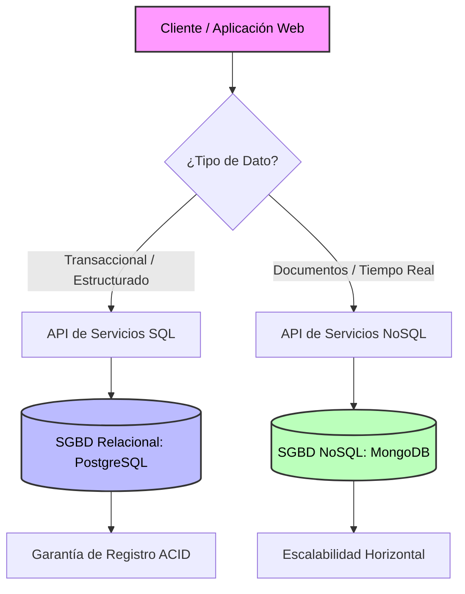

# Universidad Juárez Autónoma de Tabasco
**División Académica de Ciencias y Tecnologías de la Información**  
**Carrera:** Ingeniería en Sistemas Computacionales  
**Asignatura:** Tecnologías de la Información y la Comunicación  
**Docente:** García Ulin Ninfa Urania  
**Alumno:** Castro Ruiz Angel Nahum  
**Matrícula:** 242H17030  
**Fecha:** Septiembre de 2026  

---

# Propuesta de Selección e Implementación de Sistemas de Gestión de Bases de Datos (SGBD) para PyMEs

## Resumen Ejecutivo
El presente documento tiene como objetivo analizar las necesidades de almacenamiento y procesamiento de información en Pequeñas y Medianas Empresas (PyMEs) en México. A través de este estudio, se evalúan las diferencias arquitectónicas entre las **Bases de Datos Relacionales (SQL)** y las **No Relacionales (NoSQL)**, proponiendo una guía técnica estandarizada para la correcta adopción de un Sistema de Gestión de Bases de Datos (SGBD).

---

## 1. Introducción al Problema
En el entorno empresarial contemporáneo, la gestión eficiente de la información es un factor crítico de competitividad. Múltiples organizaciones continúan utilizando hojas de cálculo (como Microsoft Excel) como si fuesen bases de datos centralizadas. Esta práctica genera serios inconvenientes:

* **Inconsistencia y duplicidad:** Ausencia de restricciones de integridad referencial.
* **Falta de concurrencia:** Incapacidad para soportar múltiples accesos simultáneos con operaciones de escritura seguras.
* **Riesgos de seguridad:** Escasos controles de acceso granular y vulnerabilidades en el resguardo de datos sensibles.

Por lo tanto, es indispensable la transición hacia un SGBD formal que garantice disponibilidad, escalabilidad y seguridad.

---

## 2. Comparativa Técnica: SQL vs. NoSQL
Para determinar la solución adecuada según el tipo de datos, se presenta la siguiente tabla comparativa:

| Criterio de Evaluación | Bases de Datos Relacionales (SQL) | Bases de Datos No Relacionales (NoSQL) |
| :--- | :--- | :--- |
| **Estructura de Datos** | Tablas con filas y columnas (Estructurados). | Documentos (JSON), Clave-Valor, Grafos (No estructurados). |
| **Garantía Transaccional** | Cumplimiento estricto de **ACID** (Atomicidad, Consistencia, Aislamiento, Durabilidad). | Cumplimiento del modelo **BASE** (Disponibilidad Básica, Estado Blando, Eventual Consistencia). |
| **Escalabilidad** | Principalmente **Vertical** (Aumentar CPU/RAM del servidor). | Principalmente **Horizontal** (Añadir más nodos al clúster). |
| **Lenguaje de Consulta** | SQL (Structured Query Language). | APIs específicas, lenguajes basados en JSON o librerías de cliente. |
| **Ejemplos Populares** | PostgreSQL, MySQL, Oracle Database, Microsoft SQL Server. | MongoDB, Cassandra, Redis, Amazon DynamoDB. |
| **Caso de Uso Ideal** | Transacciones bancarias, ERPs, inventarios y nóminas. | Análisis de Big Data en tiempo real, redes sociales y catálogos cambiantes. |

---

## 3. Diagrama de Arquitectura y Flujo de Procesamiento
A continuación se ilustra el flujo de decisiones y la arquitectura de datos integrada en un entorno híbrido (*Persistencia Políglota*):

---

## 4. Plan de Implementación Sugerido
Para realizar la migración exitosa desde un entorno informal hacia un SGBD, se recomiendan las siguientes fases operativas:

1. **Modelado y Diseño de Datos:**
   * Crear el modelo Entidad-Relación (E-R) o la estructura de colecciones NoSQL.
   * Definir claves primarias, claves foráneas e índices de rendimiento.
2. **Estrategia de Migración y ETL (Extract, Transform, Load):**
   * Depurar y limpiar los datos alojados en las hojas de cálculo existentes.
   * Ejecutar scripts automatizados de carga de datos.
3. **Pruebas de Carga y Seguridad:**
   * Aplicar políticas de roles y permisos de usuario (RBAC).
   * Validar tiempos de respuesta ante consultas concurrentes.

---

## 5. Referencias (Formato APA 7)

1. **AWS Documentation.** (2024). *Comparing SQL and NoSQL Databases*. Amazon Web Services. Recuperado de https://aws.amazon.com/es/relational-database/
2. **Codd, E. F.** (1970). A relational model of data for large shared data banks. *Communications of the ACM*, 13(6), 377–387.
3. **Fowler, M.** (2012). *NoSQL Distilled: A Brief Guide to the Emerging World of Polyglot Persistence*. Addison-Wesley Professional.
4. **IBM Think.** (2024). *¿Qué es una base de datos?* IBM España. Recuperado de https://www.ibm.com/mx-es/think/topics/database
